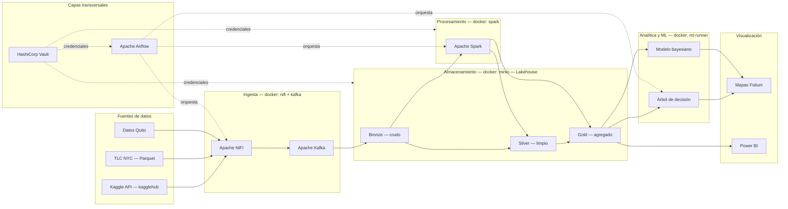
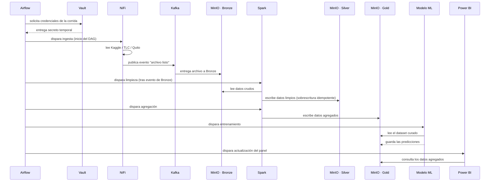

# Arquitectura de un Ecosistema de Big Data On-Premise para el Análisis Comparativo de Rutas Críticas de Transporte: Casos Nueva York y Quito

*Documento técnico — capítulo de arquitectura, tesis de maestría*
*8 de septiembre de 2026*

> Este documento y sus figuras son de uso interno del proyecto y permanecen dentro de este repositorio; no se publican en servicios externos.

**Resumen —** Este documento describe la arquitectura de un ecosistema de Big Data desplegado en un entorno on-premise mediante contenedores Docker, propuesto para sustituir el flujo actual de trabajo del proyecto de tesis, que hasta la fecha se apoya en archivos sueltos alojados en Google Drive. Se presenta un diagrama conceptual de los componentes del ecosistema, un diagrama de comportamiento que describe su ejecución en tiempo real, y la fundamentación teórica de los patrones de diseño y de comportamiento aplicados. La arquitectura resultante clasifica la información en un patrón de almacenamiento por capas (Bronze, Silver y Gold), automatiza su procesamiento mediante un orquestador, y resuelve la gestión de credenciales mediante un componente dedicado de seguridad. El caso de estudio conserva el análisis ya desarrollado por el estudiante — descarga de datos, limpieza y modelado de rutas críticas de tránsito para las ciudades de Nueva York y Quito — y únicamente redirige sus fuentes de lectura y escritura hacia el nuevo repositorio gestionado.

**Palabras clave —** arquitectura de Big Data, on-premise, arquitectura medallón, patrones de diseño, orquestación de datos, seguridad de la información.

## I. Introducción

El proyecto de tesis parte de un diagnóstico realizado por el tutor durante una sesión de revisión: el trabajo desarrollado hasta ese momento —descarga de datos desde Kaggle, limpieza con `pandas`, entrenamiento de un árbol de decisión y visualización de rutas críticas mediante mapas interactivos— es correcto desde el punto de vista de la programación, pero no constituye una arquitectura de Big Data. Tal como se registró en la transcripción de dicha sesión, el problema no es el análisis en sí, sino que "para hacer un sistema debe tener una arquitectura, debe tener patrones de diseño, patrones de comportamiento" [1], y que toda la información residía en una carpeta de Drive sin capas de ingesta, almacenamiento ni seguridad separadas entre sí.

A partir de esa observación, el cliente confirmó que el entorno de despliegue sería on-premise, descartando cualquier proveedor de nube, y que el alcance del proyecto se trata como una prueba de concepto (POC) de tipo MVP: el objetivo no es sostener una carga productiva ni garantizar alta disponibilidad, sino demostrar, de forma completa y defendible, que las capas propias de un ecosistema de Big Data —ingesta, almacenamiento, procesamiento, analítica y visualización— existen como componentes reales y separados, y no como pasos secuenciales de un mismo script.

Este documento presenta esa arquitectura en dos niveles complementarios. La sección III describe el nivel conceptual: de qué componentes está hecho el ecosistema y cómo se comunican entre sí. La sección IV describe el nivel de comportamiento: el orden en que esos componentes se activan durante una ejecución real del pipeline, gobernado por un orquestador. La sección II fundamenta, con referencias de la literatura de arquitectura de software, cada uno de los patrones que sostienen ambos niveles, respondiendo directamente a la exigencia del tutor de que el proyecto se presente como un sistema y no como un programa aislado.

## II. Marco de referencia: patrones de diseño y de comportamiento

La diferencia entre un script y una arquitectura reside, según la literatura clásica de patrones de software, en la existencia de una organización explícita de responsabilidades entre componentes y de reglas que gobiernan cómo esos componentes interactúan en tiempo de ejecución. Esta sección retoma esa distinción y la aplica al ecosistema propuesto.

La separación del ecosistema en capas independientes —ingesta, almacenamiento, procesamiento, analítica y visualización, cada una desplegada en su propio contenedor Docker— corresponde al patrón de **arquitectura en capas** (*Layered Architecture*), descrito por Buschmann et al. como una organización en la que cada capa ofrece servicios a la capa superior y consume servicios de la inferior, sin conocer los detalles internos de ninguna de las dos [2]. Bajo este patrón, el motor de procesamiento (Spark) no necesita saber cómo NiFi movió un archivo hasta el almacenamiento; únicamente necesita saber que ese archivo existe en la zona Bronze.

Dentro de la capa de almacenamiento, la clasificación de los datos en tres instancias sucesivas —Bronze (crudo), Silver (limpio) y Gold (agregado)— sigue el patrón conocido en la industria como **arquitectura medallón** (*medallion architecture* o *multi-hop architecture*), documentado por Databricks como el estándar de facto para organizar *lakehouses* de forma que cada etapa de transformación sea auditable y reprocesable de forma independiente [6]. Este patrón es, a su vez, un caso particular de **tuberías y filtros** (*Pipes and Filters*), en el que cada trabajo de limpieza o agregación actúa como un filtro que lee de una tubería de datos y escribe en la siguiente, permitiendo que cada etapa se pruebe y sustituya sin afectar a las demás [2], [3].

El movimiento de los archivos desde las fuentes de origen hasta el almacenamiento sigue el patrón **productor-consumidor**, en el que NiFi actúa como productor de eventos de ingesta y Kafka como canal que los entrega a los consumidores interesados —en este caso, los trabajos de Spark—, desacoplando el momento en que un dato llega del momento en que se procesa [3], [5]. La coordinación del pipeline completo, por su parte, corresponde al patrón de **orquestador o mediador** (*Mediator*), definido originalmente por Gamma et al. como un mecanismo que evita el acoplamiento directo entre los objetos que colaboran entre sí, delegando esa coordinación a un tercero [4]: ningún componente invoca directamente a otro, sino que es Apache Airflow quien decide el orden de ejecución, gestiona los reintentos y resuelve las dependencias entre tareas [11].

Finalmente, dos decisiones de comportamiento completan la arquitectura. La primera es que toda escritura del pipeline hacia Silver o Gold se realiza mediante sobrescritura particionada (*idempotent write*) en lugar de una simple adición de registros, de forma que reejecutar una tarea tras un fallo del orquestador no produzca datos duplicados —una práctica estándar en el diseño de sistemas de datos intensivos descrita por Kleppmann [5]—. La segunda es que ninguna credencial de acceso se almacena en texto plano dentro del código o del repositorio: HashiCorp Vault las entrega de forma centralizada y en tiempo de ejecución a MinIO, Spark y Airflow, aplicando el patrón de **gestión externalizada de secretos** [12]. Esta decisión responde de manera directa a la advertencia del tutor de que "tener información en el drive no me garantiza absolutamente nada" [1].

## III. Arquitectura propuesta

La Tabla I resume el inventario completo de artefactos que componen el ecosistema. Se trata de las mismas siete piezas que el tutor mostró como referencia válida para un entorno on-premise durante la sesión de revisión —"Docker para la ingesta donde instalaron Apache NiFi y Kafka, Docker para el almacenamiento donde instalaron MinIO, Docker para el procesamiento donde instalaron Apache Spark [...] y le ponemos seguridades con Vault" [1]— por lo que no se presentan como un subconjunto reducido, sino como el esquema completo solicitado, dejando abierta únicamente la posibilidad de sustituir alguna herramienta específica por una equivalente, tal como el propio tutor lo permitió explícitamente.

**TABLA I. INVENTARIO DE ARTEFACTOS POR CAPA**

| Capa | Herramienta | Rol en el ecosistema | Contenedor Docker |
|---|---|---|---|
| Ingesta | Python (`kagglehub`, descarga TLC) | Extrae el dataset NYC Yellow Taxi y los datos de Quito desde las fuentes de origen | `ingestion-runner` |
| Ingesta | Apache NiFi [7] | Lee los archivos descargados y los carga a la zona Bronze, con trazabilidad del flujo | `nifi` |
| Ingesta | Apache Kafka [8] | Canal de eventos entre NiFi y el almacenamiento | `kafka` + `zookeeper` |
| Almacenamiento | MinIO [10] | *Lakehouse* compatible con S3, con instancias Bronze, Silver y Gold | `minio` |
| Procesamiento | Apache Spark [9] | Migra la limpieza que hoy vive en `pandas` a trabajos que leen de Bronze y escriben en Silver/Gold | `spark-master` + `spark-worker` |
| Analítica y ML | scikit-learn, PyMC | Árbol de decisión y modelo bayesiano ya existentes, entrenados sobre Gold | `ml-runner` |
| Orquestación | Apache Airflow [11] | DAG único que coordina ingesta, limpieza, agregación, entrenamiento y visualización | `airflow-webserver` + `airflow-scheduler` |
| Seguridad | HashiCorp Vault [12] | Gestiona las credenciales de MinIO, Spark y Airflow | `vault` |
| Visualización | Power BI, mapas Folium | Panel de rutas críticas comparadas entre Nueva York y Quito | Nativo o `metabase`/`superset` |

La Fig. 1 representa este inventario como un diagrama conceptual: el flujo estático de los datos desde las fuentes de origen hasta el panel de visualización, pasando por cada una de las capas descritas.

**Fig. 1.** Diagrama conceptual del ecosistema de Big Data on-premise.

*Nota sobre las fuentes de datos:* las dos fuentes de la Fig. 1 son gratuitas y de acceso abierto, lo cual conviene documentar en el capítulo de metodología. El dataset de la Comisión de Taxis y Limusinas de Nueva York (TLC) se descarga mediante una URL pública sin necesidad de cuenta ni clave de acceso; el dataset de Kaggle, aunque también gratuito, requiere la creación de una cuenta y de un token personal (`kaggle.json`) para autenticarse a través de `kagglehub`.

*Nota de renderizado:* si el diagrama anterior no se muestra correctamente en el visor utilizado, instale en Visual Studio Code la extensión "Markdown Preview Mermaid Support" y ábralo con `Cmd+Shift+V`; GitHub y GitLab lo renderizan de forma nativa al alojar el repositorio.

## IV. Comportamiento del sistema

Mientras que la Fig. 1 describe de qué está hecho el ecosistema, la Fig. 2 describe cómo se comporta durante una ejecución real, mostrando el orden temporal en que cada componente se activa y qué mensajes intercambia con los demás. Esta distinción entre estructura y comportamiento es, precisamente, la que el tutor señaló como ausente en el trabajo original.

**Fig. 2.** Diagrama de comportamiento (secuencia) de una ejecución del pipeline orquestado por Airflow.

La secuencia descrita en la Fig. 2 hace explícitos los patrones fundamentados en la sección II: el orquestador (Mediator) decide cuándo se activa cada tarea; el par NiFi–Kafka opera como productor y consumidor desacoplados; Spark escribe de forma idempotente en Silver y Gold; y Vault entrega las credenciales de la corrida antes de que cualquier otro componente acceda al almacenamiento, evitando que dichas credenciales queden expuestas en el código del pipeline.

## V. Seguridad de la infraestructura

Durante la sesión de revisión, el tutor advirtió de forma directa que, en la defensa del proyecto, "le van a preguntar qué seguridades tiene" [1]. La Tabla II traduce esa advertencia en controles concretos, contrastando cada riesgo presente en el flujo de trabajo anterior —basado en una carpeta de Drive— con el mecanismo que lo sustituye en la arquitectura propuesta.

**TABLA II. RIESGOS IDENTIFICADOS Y CONTROLES APLICADOS**

| Riesgo en el flujo anterior (Drive) | Control aplicado en la arquitectura propuesta |
|---|---|
| Carpeta editable y legible por cualquier persona con el enlace | Control de acceso por instancia en MinIO (Bronze, Silver, Gold), cada una con credenciales propias |
| Ausencia de gestión de contraseñas: no existe un registro de dónde están ni quién las posee | HashiCorp Vault centraliza y entrega las credenciales en tiempo de ejecución; ningún archivo del repositorio contiene contraseñas en texto plano |
| El dataset crudo podía modificarse sin dejar rastro | La zona Bronze es de solo lectura una vez escrita; solo un trabajo de Spark autenticado mediante Vault puede leerla |
| Ausencia de trazabilidad sobre quién movió o accedió a un archivo | NiFi registra cada flujo de ingesta y Airflow conserva el historial de cada ejecución del DAG (éxito, fallo, reintento) |
| Ejecución conjunta en un mismo entorno de Colab, sin aislamiento entre procesos | Cada capa se ejecuta en un contenedor Docker independiente, con acceso restringido únicamente a lo que su rol requiere |

Esta tabla constituye, en conjunto con la Fig. 1 y la Fig. 2, la base de la justificación técnica que debe incorporarse al capítulo de metodología del documento de tesis: sustituye la respuesta informal de que la información "está en el Drive" por un conjunto de controles nombrables y verificables durante la defensa.

## VI. Mapeo al caso de estudio: rutas críticas Nueva York–Quito

El código de ciencia de datos desarrollado hasta la fecha por el estudiante —contenido en el archivo `02-Bigdata2.ipynb`— no requiere reescritura bajo esta arquitectura; únicamente cambia el origen y el destino de sus operaciones de lectura y escritura, que dejan de apuntar a la carpeta de Drive para apuntar a las rutas del almacenamiento gestionado (`s3://bronze/...`, `s3://silver/...`, `s3://gold/...` sobre MinIO). La Tabla III detalla esta correspondencia paso a paso.

**TABLA III. CORRESPONDENCIA ENTRE EL NOTEBOOK ACTUAL Y LA ARQUITECTURA PROPUESTA**

| Paso actual en `02-Bigdata2.ipynb` | Ubicación en la arquitectura propuesta |
|---|---|
| Descarga vía `kagglehub` y descarga del dataset TLC vía `requests` | `ingestion-runner` → NiFi → Kafka → escritura en Bronze |
| Limpieza y renombrado de columnas con `pandas` | Trabajo de Spark: lee de Bronze, escribe en Silver |
| Construcción del dataset comparativo Nueva York–Quito | Agregación en Spark, escritura en Gold |
| Árbol de decisión (scikit-learn) | Lectura desde Gold, entrenamiento, resultado guardado nuevamente en Gold |
| Modelo bayesiano (PyMC) | Mismo patrón que el árbol de decisión, lectura desde Gold |
| Mapas Folium (`rutas_criticas_nyc.html`, `rutas_criticas_quito.html`) | Generados a partir de Gold, presentados junto al panel de Power BI |

## VII. Trabajo futuro

Tres actividades quedan pendientes tras la aprobación de esta arquitectura por parte del tutor. La primera es la implementación del archivo `docker-compose.yml` que despliega las siete piezas descritas en la Tabla I, siguiendo las convenciones de estructura de código ya definidas para el proyecto (`src/common/`, `src/ingestion/`); dicho despliegue se ejecuta de forma local mediante `docker compose up`, reservando cualquier flujo de GitHub Actions exclusivamente para tareas de integración continua —como la validación de las imágenes— y no para la operación del ecosistema. La segunda es la redacción, en el capítulo de metodología de la tesis, de la justificación técnica aquí presentada, incluyendo las Tablas I, II y III y las Fig. 1 y 2. La tercera es la migración efectiva de las funciones de lectura y escritura del notebook existente hacia el almacenamiento gestionado, conforme a la correspondencia establecida en la Tabla III.

## Referencias

[1] "Revisión de tesis — transcripción de tutoría," documento interno del proyecto, `informacion-entregada/01-revision-tesis.md`, 8 de sept. de 2026.

[2] F. Buschmann, R. Meunier, H. Rohnert, P. Sommerlad, y M. Stal, *Pattern-Oriented Software Architecture, Volume 1: A System of Patterns*. Chichester, Reino Unido: Wiley, 1996.

[3] G. Hohpe y B. Woolf, *Enterprise Integration Patterns: Designing, Building, and Deploying Messaging Solutions*. Boston, MA, EE. UU.: Addison-Wesley, 2003.

[4] E. Gamma, R. Helm, R. Johnson, y J. Vlissides, *Design Patterns: Elements of Reusable Object-Oriented Software*. Boston, MA, EE. UU.: Addison-Wesley, 1994.

[5] M. Kleppmann, *Designing Data-Intensive Applications: The Big Ideas Behind Reliable, Scalable, and Maintainable Systems*. Sebastopol, CA, EE. UU.: O'Reilly Media, 2017.

[6] Databricks, "What is a medallion architecture?" Databricks Glossary. [En línea]. Disponible: https://www.databricks.com/glossary/medallion-architecture. [Accedido: 8-sept-2026].

[7] The Apache Software Foundation, "Apache NiFi Documentation." [En línea]. Disponible: https://nifi.apache.org/documentation.html. [Accedido: 8-sept-2026].

[8] The Apache Software Foundation, "Apache Kafka Documentation." [En línea]. Disponible: https://kafka.apache.org/documentation/. [Accedido: 8-sept-2026].

[9] The Apache Software Foundation, "Apache Spark Documentation." [En línea]. Disponible: https://spark.apache.org/docs/latest/. [Accedido: 8-sept-2026].

[10] MinIO, Inc., "MinIO Object Storage Documentation." [En línea]. Disponible: https://min.io/docs/minio/linux/index.html. [Accedido: 8-sept-2026].

[11] The Apache Software Foundation, "Apache Airflow Documentation." [En línea]. Disponible: https://airflow.apache.org/docs/apache-airflow/stable/. [Accedido: 8-sept-2026].

[12] HashiCorp, "Vault Documentation." [En línea]. Disponible: https://developer.hashicorp.com/vault/docs. [Accedido: 8-sept-2026].

---
*Documento preparado para el checkpoint del 8 de septiembre de 2026. Fuentes internas del proyecto: `entregables/01-gaps-decision-cliente.md`, `informacion-entregada/01-revision-tesis.md`, `ejemploArquiteturaOnpremise.png`.*
